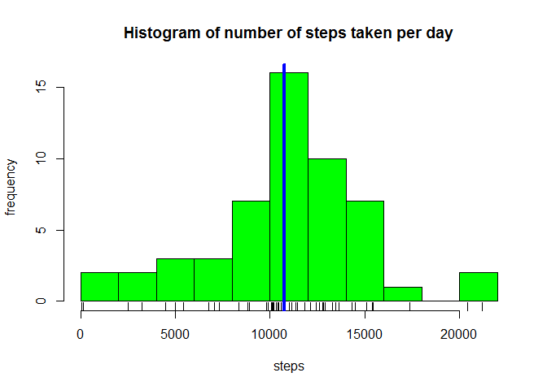
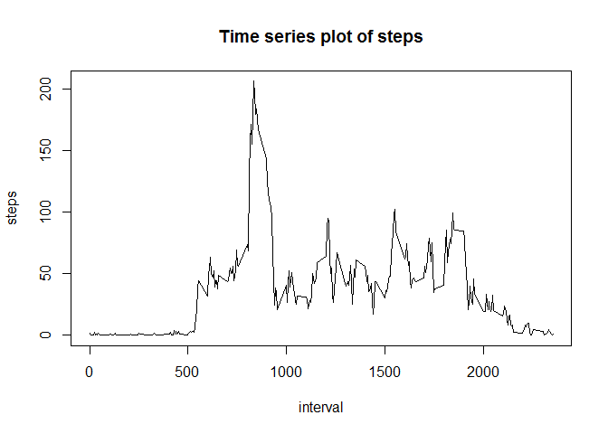
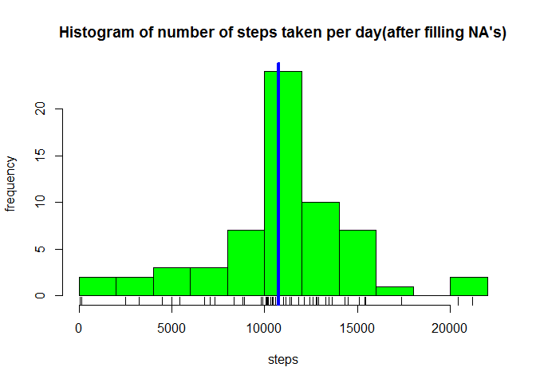
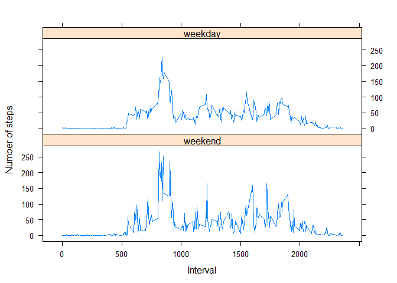

# Reproducible Research: Peer Assessment 1
## Loading libraries

```r
# install.packages("dplyr")
# install.packages("knitr")
# install.packages("tidyr")
# install.packages("lattice")
library(dplyr)
```

```
## Warning: package 'dplyr' was built under R version 3.1.3
```

```
## 
## Attaching package: 'dplyr'
## 
## The following object is masked from 'package:stats':
## 
##     filter
## 
## The following objects are masked from 'package:base':
## 
##     intersect, setdiff, setequal, union
```

```r
library(knitr)
```

```
## Warning: package 'knitr' was built under R version 3.1.3
```

```r
library(tidyr)
```

```
## Warning: package 'tidyr' was built under R version 3.1.3
```

```r
library(lattice)
```

## Loading and preprocessing the data

```r
dataframe <- read.csv("activity.csv")
data_tbl <- tbl_df(dataframe)
data_tbl <- filter(data_tbl, !is.na(steps))
data_tbl
```

```
## Source: local data frame [15,264 x 3]
## 
##    steps       date interval
## 1      0 2012-10-02        0
## 2      0 2012-10-02        5
## 3      0 2012-10-02       10
## 4      0 2012-10-02       15
## 5      0 2012-10-02       20
## 6      0 2012-10-02       25
## 7      0 2012-10-02       30
## 8      0 2012-10-02       35
## 9      0 2012-10-02       40
## 10     0 2012-10-02       45
## ..   ...        ...      ...
```

## Calculate the mean total number of steps taken per day

```r
by_date <- group_by(data_tbl, date)
summary_date <- summarize(by_date, steps = sum(steps))
summary_date
```

```
## Source: local data frame [53 x 2]
## 
##          date steps
## 1  2012-10-02   126
## 2  2012-10-03 11352
## 3  2012-10-04 12116
## 4  2012-10-05 13294
## 5  2012-10-06 15420
## 6  2012-10-07 11015
## 7  2012-10-09 12811
## 8  2012-10-10  9900
## 9  2012-10-11 10304
## 10 2012-10-12 17382
## ..        ...   ...
```

```r
hist(summary_date$steps, breaks = 10, col = "green", xlab = "steps", ylab = "frequency",
     main = "Histogram of number of steps taken per day")
rug(summary_date$steps)
abline(v = median(summary_date$steps), lwd = 4, col = "blue")
```

 

```r
median(summary_date$steps)
```

```
## [1] 10765
```

```r
mean(summary_date$steps)
```

```
## [1] 10766.19
```
## What is the average daily activity pattern?

```r
by_interval <- group_by(data_tbl, interval)
summary_interval <- summarize(by_interval, steps = mean(steps))
summary_interval
```

```
## Source: local data frame [288 x 2]
## 
##    interval     steps
## 1         0 1.7169811
## 2         5 0.3396226
## 3        10 0.1320755
## 4        15 0.1509434
## 5        20 0.0754717
## 6        25 2.0943396
## 7        30 0.5283019
## 8        35 0.8679245
## 9        40 0.0000000
## 10       45 1.4716981
## ..      ...       ...
```

```r
plot(summary_interval$interval, summary_interval$steps, type = "l", xlab = "interval", ylab = "steps",
     main = "Time series plot of steps") 
```

 

```r
# The time interval with the averaged max steps
summary_interval$interval[summary_interval$steps == max(summary_interval$steps)]
```

```
## [1] 835
```
## Imputing missing values

```r
sum(is.na(dataframe$steps))
```

```
## [1] 2304
```

```r
# Fill in missing values in a new dataframe(according to the mean of each time interval)
missing_indices <- which(is.na(dataframe$steps), arr.ind=TRUE)
targetIntervals <- dataframe$interval[missing_indices]
fillIn <- c();
for(i in targetIntervals)
  fillIn <- c(fillIn, summary_interval$steps[summary_interval$interval == i]);
newDataframe <- dataframe
newDataframe$steps[is.na(dataframe$steps)] <- fillIn

data_tbl_new <- tbl_df(newDataframe)
by_date_new <- group_by(data_tbl_new, date)
summary_date_new <- summarize(by_date_new, steps = sum(steps))
summary_date_new
```

```
## Source: local data frame [61 x 2]
## 
##          date    steps
## 1  2012-10-01 10766.19
## 2  2012-10-02   126.00
## 3  2012-10-03 11352.00
## 4  2012-10-04 12116.00
## 5  2012-10-05 13294.00
## 6  2012-10-06 15420.00
## 7  2012-10-07 11015.00
## 8  2012-10-08 10766.19
## 9  2012-10-09 12811.00
## 10 2012-10-10  9900.00
## ..        ...      ...
```

```r
hist(summary_date_new$steps, breaks = 10, col = "green", xlab = "steps", ylab = "frequency",
     main = "Histogram of number of steps taken per day(after filling NA's)")
rug(summary_date_new$steps)
abline(v = median(summary_date_new$steps), lwd = 4, col = "blue")
```

 

```r
median(summary_date_new$steps)
```

```
## [1] 10766.19
```

```r
mean(summary_date_new$steps)
```

```
## [1] 10766.19
```
After imputing the NA's, the mean stays the same(because we fill NA's with mean step values of corresponding intervals), which cause them to be non-integer. So the median would be non-integer, too.

## Are there differences in activity patterns between weekdays and weekends?

```r
wday <- as.POSIXlt(summary_date_new$date)$wday > 0 & as.POSIXlt(summary_date_new$date)$wday < 6
newDataframe$dayType <- factor(wday, labels = c("weekend", "weekday"))
data_tbl_new <- tbl_df(newDataframe)
by_interval_new <- group_by(data_tbl_new, interval, dayType)
summary_interval_new <- summarize(by_interval_new, steps = mean(steps))
summary_interval_new
```

```
## Source: local data frame [576 x 3]
## Groups: interval
## 
##    interval dayType       steps
## 1         0 weekend 0.000000000
## 2         0 weekday 2.327463312
## 3         5 weekend 0.021226415
## 4         5 weekday 0.452830189
## 5        10 weekend 0.041273585
## 6        10 weekday 0.164360587
## 7        15 weekend 0.037735849
## 8        15 weekday 0.191194969
## 9        20 weekend 0.009433962
## 10       20 weekday 0.098951782
## ..      ...     ...         ...
```

```r
xyplot(summary_interval_new$steps ~ summary_interval_new$interval 
       | summary_interval_new$dayType, layout = c(1, 2),
       type = "l", xlab = "Interval", ylab = "Number of steps")
```

 
